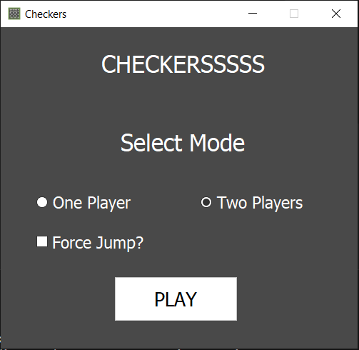
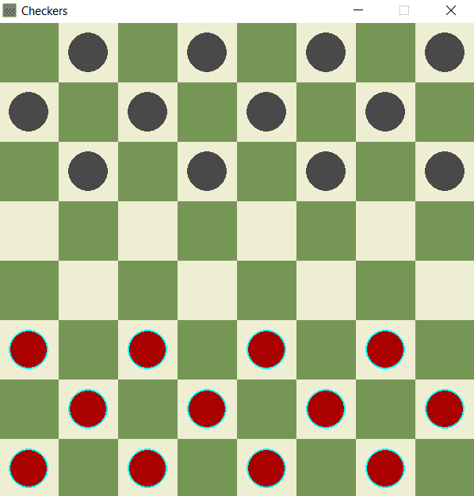
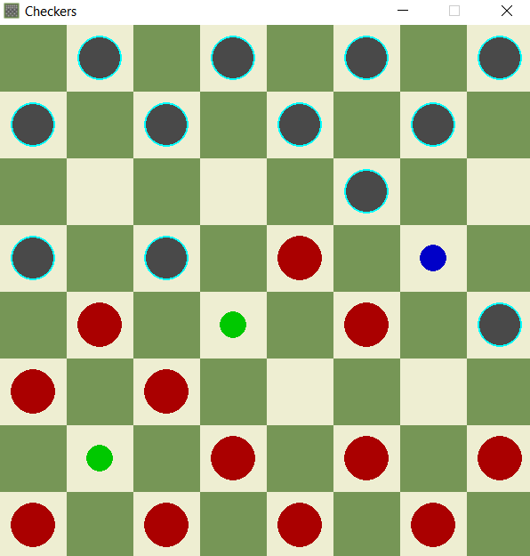
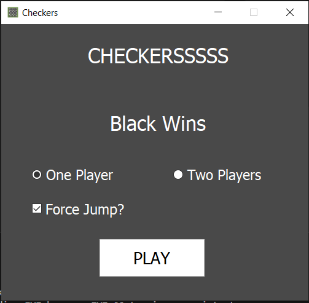
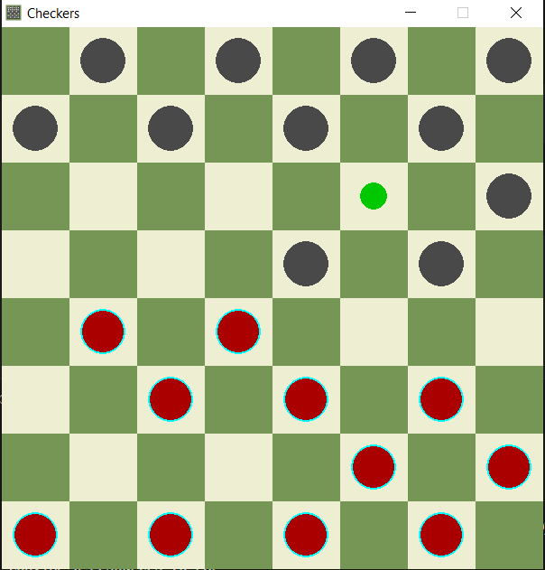

# Checkers.py

## Description

Project for playing checkers. App supports two game modes: Single Player (player vs bot) or two players (player vs player) and with or without fourcing jumps. This project was created as project for algorithms and data structures, subject in II semestar on Faculty of tehnical science in Novi Sad using minimax algorithm with alpha-beta pruning with changing depth.

## Features

App allows users to player against bot or another player with or without forcing jumps.

Game has intutive UI that show user available moves for selected piece by marking places where piece can move with blue dot and marking jumps with green dots. Current player is marked with cyan outline.

Bot is using minimax algorithm with alpha-beta pruning with changing depth.

All features are specified in [project specification](./materials/Projekat%201%20v.25.03.2024..pdf)


## Setup

App can be started by:

- activating ```main.py``` script - need access to src, assets and cache
- using ```checkers.exe``` executable (Windows only) - need access to assets and cache
- running ```Checkers.msi``` installer (can be downloaded from [releases](https://github.com/MihajloMilojevic/Checkers.py/releases/tag/windows))

## Credits

Optimal heuristic algorithm and weight are taken from [Kevin Gregor's Github](https://github.com/kevingregor/Checkers)

## License

This project is licensed under the MIT License - see the LICENSE file for details.

## Preview

<figure style="display: flex; flex-direction: column; gap: 10px; align-items: center; justify-content: center">
    
    <caption ><i>Starting window</i></caption>
</figure>

<figure style="display: flex; flex-direction: column; gap: 10px; align-items: center; justify-content: center">
    
    <caption ><i>Game window</i></caption>
</figure>

<figure style="display: flex; flex-direction: column; gap: 10px; align-items: center; justify-content: center">
    
    <caption ><i>Making moves</i></caption>
</figure>

<figure style="display: flex; flex-direction: column; gap: 10px; align-items: center; justify-content: center">
    
    <caption ><i>Game over window</i></caption>
</figure>

<figure style="display: flex; flex-direction: column; gap: 10px; align-items: center; justify-content: center">
    
    <caption ><i>Forcing jumps</i></caption>
</figure>
